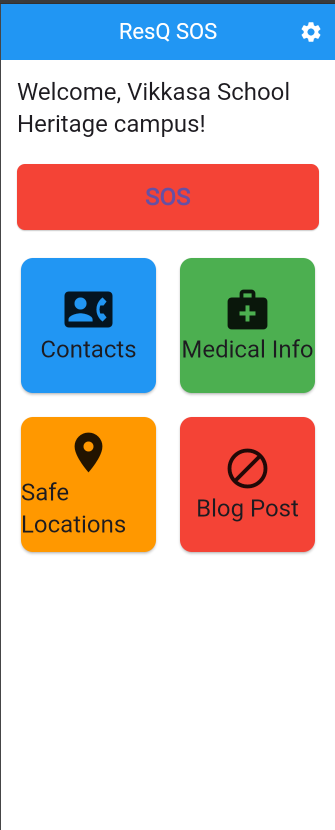
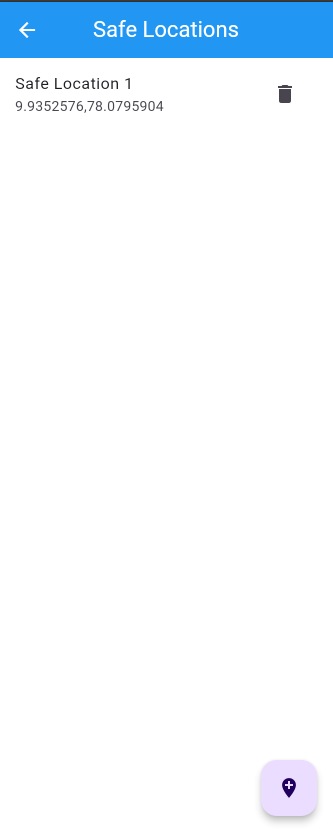
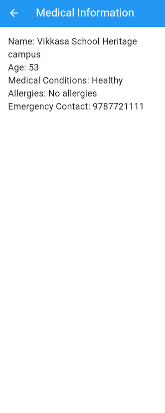
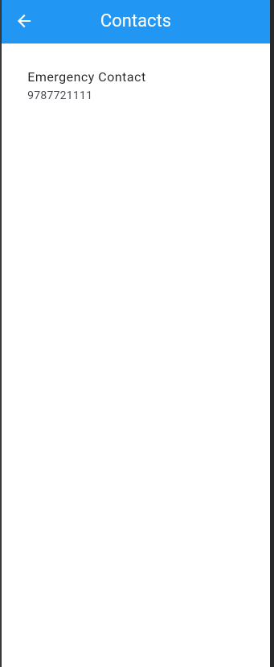
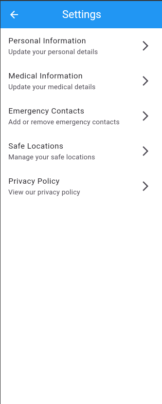

# ResQ SOS 🚨


ResQ SOS is a Flutter application designed to provide emergency assistance and information. The app includes features such as safe locations, medical information, and contact options.

## Table of Contents 📚

- [Features](#features)
- [Installation](#installation)
- [Usage](#usage)
- [Screenshots](#screenshots)
- [Development](#development)
- [Contributing](#contributing)
- [License](#license)

## Features ✨

- **Safe Locations**: Find and navigate to safe locations in case of an emergency.
- **Medical Information**: Store and access important medical information.
- **Contact Options**: Quickly contact emergency services or predefined contacts.
- **Onboarding**: A guided onboarding process for new users.
- **Blog**: Access to a blog with useful articles and information.
- **Settings**: Customize app settings to suit your preferences.

## Installation 🛠️

To get started with ResQ SOS, follow these steps:

1. **Clone the repository**:
    ```sh
    git clone https://github.com/yourusername/resq_final_2.git
    cd resq_final_2
    ```

2. **Install dependencies**:
    ```sh
    flutter pub get
    ```

3. **Run the app**:
    ```sh
    flutter run
    ```

## Usage 🚀

Once the app is installed, you can use the following features:

- **Home Screen**: Access the main features of the app.
- **Safe Locations Screen**: View and navigate to safe locations.
- **Medical Info Screen**: Store and view medical information.
- **Contact Screen**: Quickly contact emergency services or predefined contacts.
- **Settings Screen**: Customize app settings.
- **Splash Screen**: Initial loading screen.
- **Onboarding Screen**: Guided onboarding for new users.
- **Blog Screen**: Access useful articles and information.

## Screenshots 📸

Here are some screenshots of the app:

### Home Screen
 

### Medical Info Screen
 

### Settings Screen


## Development 👩‍💻👨‍💻

To contribute to the development of ResQ SOS, follow these steps:

1. **Fork the repository** on GitHub.
2. **Clone your fork**:
    ```sh
    git clone https://github.com/yourusername/resq_final_2.git
    cd resq_final_2
    ```
3. **Create a new branch** for your feature or bugfix:
    ```sh
    git checkout -b feature/your-feature-name
    ```
4. **Make your changes** and commit them:
    ```sh
    git commit -m "Add your commit message"
    ```
5. **Push your changes** to your fork:
    ```sh
    git push origin feature/your-feature-name
    ```
6. **Create a pull request** on GitHub.

## Contributing 🤝

We welcome contributions from the community! Please read our [contributing guidelines](CONTRIBUTING.md) for more information.

## License 📄

This project is licensed under the MIT License. See the [LICENSE](LICENSE) file for details.
